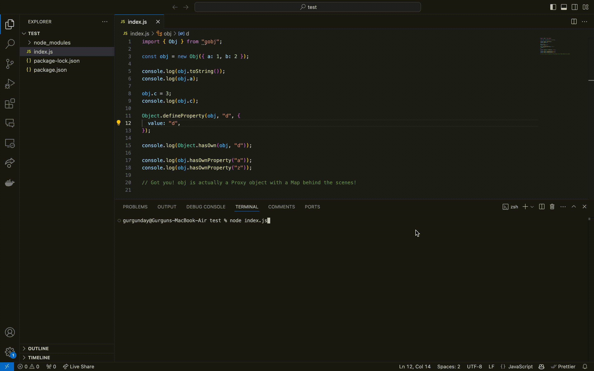

# gobj 

snu**gobj**ect is a mutable JavaScript Object with an immutable hidden class.

Works in the browser. No runtime dependencies. Drop-in\* replacement to Object. [Comparable performance.](#benchmarks)



## Installation

```sh
npm i gobj
```

Or import directly from a CDN:

```js
import { Obj } from "https://cdn.jsdelivr.net/npm/gobj/+esm";
```

## API

### `Obj`

The `Obj` class creates a mutable JavaScript object with an immutable hidden class, powered by a `Map` and a `Proxy`.

#### Constructor

```js
new Obj(initialData);
```

- `initialData` (object, optional): The initial data to populate the object with. Defaults to an empty object `{}`.

The constructor may throw:

- `TypeError`: If `initialData` is not an object.

## Usage

```js
import { Obj } from "gobj";

const obj = new Obj({
  name: "John Doe",
  age: 30,
});

console.log(obj.name); // Output: "John Doe"
console.log(obj.age); // Output: 30

obj.email = "john@example.com";
console.log(obj.email); // Output: "john@example.com"

delete obj.age; // Output: true
console.log(obj.age); // Output: undefined

console.log(Object.keys(obj)); // Output: ["name", "email"]
console.log(JSON.stringify(obj)); // Output: '{"name":"John Doe","email":"john@example.com"}'
```

`Obj` supports all standard object operations, including property access, modification, deletion, and iteration.

## How It Works

Under the hood, `gobj` uses a `Map` to store the object's properties and a `Proxy` to intercept and handle all standard object operations. This allows for efficient property access and modification while maintaining an immutable hidden class.

## Benchmarks

TODO: Add benchmarks comparing `gobj` to regular JavaScript objects and other similar libraries.
